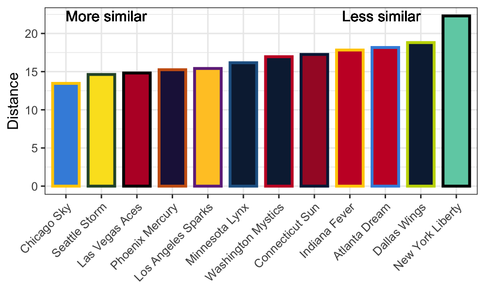
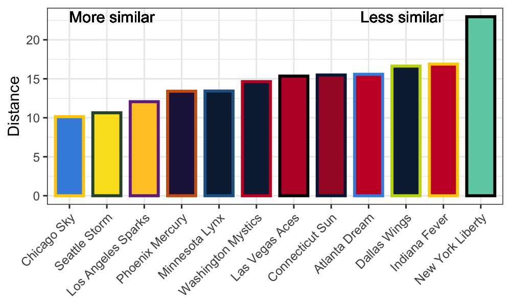

# Which WNBA team should I watch? 
## Do you like the offensive rebounding? How about the mid range game? Are you a fan of the Spurs? Or wish you could watch the 2010 version? 
In this post I compare the WNBA to the NBA on a number of statistics throughout the last 10 seasons.   To address these questions I created a Shiny app hosted [here](https://zoevernon.shinyapps.io/nba_wnba_comp/).  I present some of the interesting findings in this post, but encourage you to play with the app on your own!  

## Comparing the leagues 
First, I wanted to figure out how the WNBA differs from the NBA across the last 10 seasons.   The two leagues have largely followed similar trajectories (i.e. more threes and less offensive rebounds) but there are many differences between them, some surprising and others evident to people who watch both men's and women's basketball. 

After watching a couple WNBA games one of the most apparent differences from the NBA is the shot distribution.  WNBA teams seem to take far more shots from the mid range than is customary in the present day NBA, and that is exactly what we see in the data.  Given that WNBA games are shorter than the NBA we compare the shot distributions between the two leagues by looking at the number of shot attempts from a given location per possession.  This allows us to look at differences without needing to adjust for time or pace.  

Using data from [stats.nba.com](stats.nba.com) and [stats.wnba.com](stats.wnba.com), we see that from 5 to 19 feet every WNBA team in the 2020 season take more mid range shots than the average NBA team in the 2019-20 season.  The New York Liberty take by far the least in the mid range while the Las Vegas Aces, with A'ja Wilson and their interior dominance, take over 40% of their shots from these distances.  In the NBA San Antonio are the only team that take above 30% of their shots from 5 - 19 feet, and the Houston Rockets take only 15%.  

<iframe width="600" height="400" frameborder="0" scrolling="no" src="//plotly.com/~zo3v3rnon/1.embed"></iframe>

In addition to checking how the distributions differ between teams this season, I looked at the change over the last 10 seasons.  Here we see that the reduction in midrange shots has occurred much more dramatically in the NBA than the WNBA.  

<iframe width="600" height="400" frameborder="0" scrolling="no" src="//plotly.com/~zo3v3rnon/3.embed"></iframe>

This increase in midrange shot taking is coupled with less shot attempts in the WNBA from the three point range.  Below, we see both the trend in 3 point attempts per possession over time and the distribution from the current season.   To see the distribution for the 2020 WNBA and 2019-20 NBA seasons check [Shiny app](https://zoevernon.shinyapps.io/nba_wnba_comp/).    Prior to moving the three point line back for the 2013 season, WNBA teams were taking more 3FGA per possession than NBA team on average.    
 
 <!--- <iframe width="600" height="400" frameborder="0" scrolling="no" src="//plotly.com/~zo3v3rnon/5.embed"></iframe> --->
<iframe width="600" height="400" frameborder="0" scrolling="no" src="//plotly.com/~zo3v3rnon/7.embed"></iframe>

At this point the obvious question to ask is why is this the case?  Is the WNBA less sold on analytics, which has shown the superiority of the three pointer?  Or is there a fundamental difference between the leagues that makes threes less valuable in the WNBA?  

Without knowing the extent to which WNBA teams have analytics departments, I think the answer is falls somewhere in between.  Looking at the difference in 3FG % between the two leagues we can see that WNBA players shoot much worse than NBA players from 3, however, they also shoot worse from 2.  It seems that only 

Across the board NBA players, shoot a higher percentage from the field.   However, WNBA players are much better FT shooters.   When it comes to 3 pointers we can see the impact of the extension of the 3 point line in the WNBA before the 2013 season.    Prior to the change, the WNBA was not only shooting more threes than NBA teams at the time, but they were shooting better from three.  Over time WNBA players have adjusted and despite, a slower increase in 3 pointers per possession, they have dramatically increased 3 point percentage over the last couple years.  

<iframe width="600" height="400" frameborder="0" scrolling="no" src="//plotly.com/~zo3v3rnon/13.embed"></iframe>

<iframe width="600" height="400" frameborder="0" scrolling="no" src="//plotly.com/~zo3v3rnon/11.embed"></iframe>

<iframe width="600" height="400" frameborder="0" scrolling="no" src="//plotly.com/~zo3v3rnon/9.embed"></iframe>

<iframe width="600" height="400" frameborder="0" scrolling="no" src="//plotly.com/~zo3v3rnon/15.embed"></iframe>

## Comparing the teams
Now for the fun part! If you're a fan of the Bucks I am hoping to tell you which WNBA team you might enjoy watching.  Or maybe you love to watch the Rockets take threes?  How about you just miss watching the 2014-15 Warriors offense, the [app](https://zoevernon.shinyapps.io/nba_wnba_comp/) can help you find the best fit in the WNBA based on the statistics that you care about.   Below are a couple examples.  

### I'm a Bucks fan
Let's say I want to see which WNBA teams play most like the Bucks across all the statistical categories we have available.   Then we would see that the Chicago Sky are most similar, followed by the Seattle Storm and the LA Sparks.   In general, the better WNBA teams are more similar to the Bucks and the worse teams are less similar.   

### I love to watch a team that shoots a lot of threes
CHANGE THIS TO THE SPURS, so it can be a different team 

If your favorite thing to do is watch an offense predicated around the three pointer, you could see which WNBA teams are most like the Rockets in terms of their shot distribution (by selecting FGA from various distances).  In that case you may want to tune into the New York Liberty of the Seattle Storm.  

However, be warned about the Liberty, because although they take a lot of threes, they don't shoot a high percentage.  In fact, if we include FG% statistics in addition to the FGA stats, we see that the Liberty are now least like the Rockets... try that for yourself in the app if you want to see the change.  

### My favorite offense ever was the Warriors in 2014-15
As a final example, let's say that you just loved watching the Warriors offense on the way to the first title in their recent run, because I mean who didn't? In that case you again would want to watch Chicago Sky or the Seattle Storm.  

